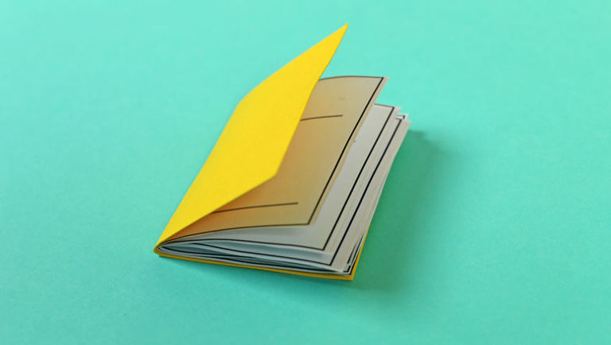
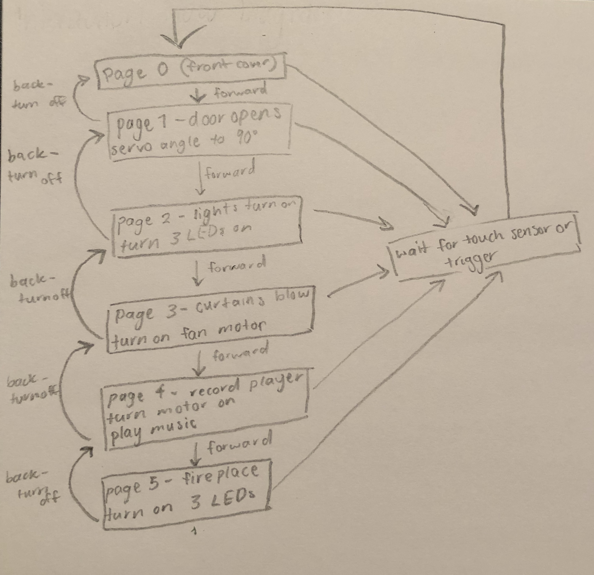

# 1701QCA Making Interaction - Assessment 2 workbook

You will use this workbook to keep track of your progress through the course and also as a process journal to document the making of your projects. The comments in italics throughout the template give suggestions about what to include. Feel free to delete those instructions when you have completed the sections.

When you have completed the template, submit the link to the GitHub Pages site for this repository as a link in Learning@Griffith. The link should be something like [https://qcainteractivemedia.github.io/1701QCA-Assessment2/](https://qcainteractivemedia.github.io/1701QCA-Assessment2/) where `qcainteractivemedia` is replaced with your GitHub username and `1701QCA-Assessment2` is replaced with whatever you called the repository this template is contained in when you set it up.

## Project working title ##
*Insert a name for the project as you conceive of it at the moment.*

## Related projects ##
*Find about 6 related projects to the project you choose. A project might be related through  function, technology, materials, fabrication, concept, or code. Don't forget to place an image of the related project in the appropriate folder and insert the filename in the appropriate places below. Copy the markdown block of code below for each project you are showing.*

### Related project 1 ###
*Charles Matton- 'Enclosure'*

*https://www.allvisualarts.org/artists/CharlesMatton/biography.aspx*

(This is an image of Matton's miniature scenes that look so life-like.)

Charles Matton was a painter, sculptor, designer, writer, photographer, videographer, and filmmaker. His work aimed to capture the tension in living things and animate nature by provoking and perfecting life. In his exhibition 'enclosures', Matton created small scale interiors within transparent boxes with glass fronts. Depicting theatrical, atmospheric scenes, the miniatures spaces are based on real world interiors and memories from Matton's life. Each scene is meticulously hand-built to a 1/7 scale. To create a more immersive experience and to depict not just how something looked ona particular day but how it felt, Matton introduced one-way mirrors and videos to add hypnotic optical illusions.

This exhibition is related to my project as it is created in miniature scale and visually depicts a story through the immense detail that make the small scenes seem so life-like. It is also related to my project as it uses electronics to create a more immersive interactive experience rather than just an art piece to admire. This project has inspired me to include many minute details so I can replicate a moment in time more accurately and make the scene more life-like, thus creating a more interesting and immersive expereince for the audience.

### Related project 2 ###
*The Music, Math, Art and Science Electronic Book  by Antonella Nonnis*

*http://www.antonellanonnis.com/?/work/theMMASElectronicBook/*

(Above is an image of one page of the electronic book that uses LEDs to match the colours when touched.)

The MMAS Electronic book is a book with four pages that teaches subjects such as Music, Maths, ARts and Science, through interactive moveable parts and other electronics. Nonnis created it to introduce some skills for the first year of primary school to her niece. The book uses physical moveable parts and uses the electrical capitance of the human body to trigger lights, sounds and other outputs. Powered by 2 Arduinos, the book was created using a range of recylced materials such as paper, foil, cardboard and other electric components such as wires, resistors and LEDs. 

This project is related to mine as it is also a book and uses touch sensors and the electrical capacitance of the human body. This project inspired me to delve deeper into the different ways of installing a touch sesnor into a book. This project is also similar to mine as it uses recycled materials and a system similar to the microbit. Therefore, this project has mad eme realise that my project is feasible with the materials I have access to.

### Related project 3 ###
*Andy Acres*

*http://andyacres.com/*
*https://www.awesomeinventions.com/andy-acres-spooky-shadow-boxes-miniature-scenes/*

(This is an image of Acre's creepy scene that uses both mechanical construction and electronic components.)

Andy Acres is a London artist that specialises in creating highly detailed and visually dynamic models and scale miniatures. Usually creating ghostly ambiences, one of Acres' works are spooky shadow box diaromas. Within these models, Acres' uses LEDs to create creepy shadows that serve as a background to emphasise the small details. the lights can also be adjusted through an antique toggle on the side of the diaroma. By creating life-like scenes that create experiences, Acres' wants his work "to not only breathe life but to exhale".

This project is related to my project because they are both in a miniature scale and wuuse electronics. Similar to Acres' I will also be using LEDs to create atmospheric lighting. I also want to make the scene look as realistic as possible by emphasising the small details. I wish to replicate Acres' notion of creating such a life-like scene that the scene not only breathes life but exhales.

### Related project 4 ###
*Joshua Smith*

*http://www.iknowjoshuasmith.com/
https://mymodernmet.com/joshua-smith-miniaturist-urban-scale-models/*

(This is an image of Smith's impressive miniatures that depict abandoned locations.)

Joshua Smith is a South Australian miniaturist and former stencil artist. Smith's miniature work mainly focuses on the ofte overlooked aspects of the urban landscape. Smith depicts things like graffiti, abandoned locations, rust and decay. In his own words Smith states, "The works I create are of buildings long forgotten and soon to be demolished. I capture their current state of a once thriving but long forgotten space.” Smith works on a 1:20 scale and uses everyday materials such as MDF, cardboard, and plastic.

This project is similar to mine as it is also created in a miniature scale. they are alos related as I will be using everday materials aswell. Within my scene I also want to add a sense of a forgotten space by using retro themed furniature and creating a dated almost abandoned look. This artist has inspired me to expand the narrative further by adding more small details that develop the realness of the scene and incorporating an old vintage feel. This project is also related to mine as he uses recycled materials. Consequently, this has shown me the amazing masterpieces you can make with everyday object which helped me realise making my project aesthetically pleasing and detailed is feasible.

### Related project 5 ###
*Animated Micro:Book*

*make.techwillsaveus.com/microbit/activities/animated-microbook*

(This is an image of the animated mircobit book that visualises a story.)

This microbit project uses the microbit pins and copper tape circuits to illustrate a short story using the LEDs on the microbit.
This project is related to mine as it follows my design intent to visually depict a story. It also includes a book like my project and it utilises the same technology/equipment of the microbit that I will also be using. This project has expanded my knowledge of different ways you can trigger action and alternatives to touch sensors.

### Related project 6 ###
*Digital Gestures Interactive Book*

*https://blog.arduino.cc/2016/09/26/a-diy-interactive-book-that-uses-digital-gestures/
https://tazasproject.com/portfolio/131/articleID.php?tazas=13*

(This is an image of the interactive book that uses hand gestures.)

A digital and craft maker lab, Tazas and a group of master students have created an interactive book that reflects just how natural digital gestures like swiping have become. The book uses ten actions: drag and drop, spread and squeeze, swipe, double tap, scroll, zoom, rotate, draw, press, press and hold. This project uses four basic electronic components and some digital fabrication: a web server (VPS), an AtHeart Blend Micro Bluetooth module linking objects to the server, an Ipod Touch connective viewing medium and conductive ink. arranged on a laser cut wooden base, the Ipod digitally decrypts the printed pages. Using the book, the viewer has the ability to interact on the screen with digital hand gestures.

This project is similar to mine as it is also an interactive book but this project uses more sophisticated technology. This project is also related to mine as it is a prototype and it uses different gesture sensors, thus expanding my knowledge of different sensors and alternatives to touch sesnors for my own project.

## Other research ##
*Include here any other relevant research you have done. This might include identifying readings, tutorials, videos, technical documents, or other resources that have been helpful. For each particular source, add a comment or two about why it is relevant or what you have taken from it.*
### *Brief resource name/description* ###

*Provide a link, reference, or whatever is required for somebody else to find the resource. Then provide a few comments about what you have drawn from the resource.*

## Conceptual progress ##

### Design intent ###
My design intention for this project is a device/model that creates an interactive experience that visually depicts a short narrative in a physical space.

### Design concept 1 ###
A mechanical electronic wall art that visually depicts a story that is read along with it. This idea could include moving parts, lights, sound and many other interactions.

Strengths
- Can be expanded in many ways 
- Visually engaging and pleasing 
- Can be created based on basically any short story 

Limitations
- Complicated and complex,combining electronics with mechanical parts 
- Will take a long time 
- May be difficult to source materials 
- Will need alot of research 

(This is an image of the planning and design process development for design concept 1).
*Outline three design concepts, each developed to a point where you anticipate it would be feasible to complete by the end of the course. Each should have a summary of the idea, a rough sketch of what it might be like, and any other notes you created while exploring the idea.* 

*Put the first two design concepts in the sections "Design concept 1" and "Design concept 2". Then put the third, with more development in the section "Final design concept".*

### Design concept 2 ###
A room interactive art installation where the action automatically starts to happen around you and your choices determine the storyline. It would be 'choose your own adventure' style as if your are in your own movie.

Strengths
- Immersive experience 
- Can be customised to any story 

Limitations
- Would take a long time 
- Too large 

- Would have to be scaled down 
- Do not have access to such a large space 

(Above is an image of design concept 2).

### Final design concept ###
A miniature model room that visually depicts a narrative in a physical model. A book is read along with it and as the action happens in writing it begins to occur in the scene in front of you.

Strengths
- Moderately easy to make as it is small 
- Easy to source materials 
- A lot of resources online 
- Could be used as a portable device 
- Can be cutomised to any story 
- Can be marketed to any target audience 
- Many different ways to execute eg. different sensors and action that could take place 

Limitations
- Could take some time 
- Would need some experimenting and prototyping 

(This is an image of my final design concept initial planning).

*This more fully developed concept should include consideration of the interaction scheme, technical functionality, fabrication approach, materials to be used, and aesthetic.*

### Interaction flowchart ###
At this point I am not sure if I will make the individual interactions stop when the page is turned back but I have included it in these interactive flow diagrams to illustrate all possible iterations.

(This is an image of one layout of my interaction flow diagram.)

(This is an image of another more detailed version of my interaction flow diagram that shows each step individually.)

More Information of the Microinteractions:
Page 1- Door Opens

Using a servo underneath the floor and a magnet connected to an attachment of the servo and the door, the servo will open the door when the angle is changed. This will introduce the story as an establishing interaction. At this point I think the door will remain open for the whole story but I may decide to close it at the end of the story.

Page 2- Lights Turn On

Lamps and wall lights will turn on. Using handmade light covers the LEDs will be installed into some type of fabricated form that resembles a light. All will turn on at the same time.

Page 3- Wind blows the curtains

Underneath the floor will be a fan attached to the motor that will blow air through a vent in the floor and consequently blow the curtains on the window as if a breeze is entering. 

Page 4- Record Player

A miniature record on a record player will begin to spin through the use of a motor. Music will also play through a speaker that I salvaged from an old home phone. The song is 'I Can't Help Falling In Love WIth You', to develop th evintage vibes more. I have coded the song already and have this whole page working successfully for the final project.

Page 5- Fireplace

In the corner of the room will be a fire place. Using LEDs removed from battery operated tea lights that flicker, the fireplace will have about three LEDs within the fire o ensure maximum ambient glow. All LEDs will turn on at the same time.

## Physical experimentation documentation ##

*In this section, show your progress including whichever of the following are appropriate for your project at this point.
a.	Technical development. Could be code screenshots, pictures of electronics and hardware testing, video of tests. 
b.	Fabrication. Physical models, rough prototypes, sketches, diagrams of form, material considerations, mood boards, etc.
Ensure you include comments about the choices you've made along the way.*

*You will probably have a range of images and screenshots. Any test videos should be uploaded to YouTube or other publicly accessible site and a link provided here.*

## Design process discussion ##
*Discuss your process in getting to this point, particularly with reference to aspects of the Double Diamond design methodology or other relevant design process.*

## Next steps ##
*Write a list or provide other information about your plan to move the project forward to be ready to present by video and documentation in week 12 of the course.*
